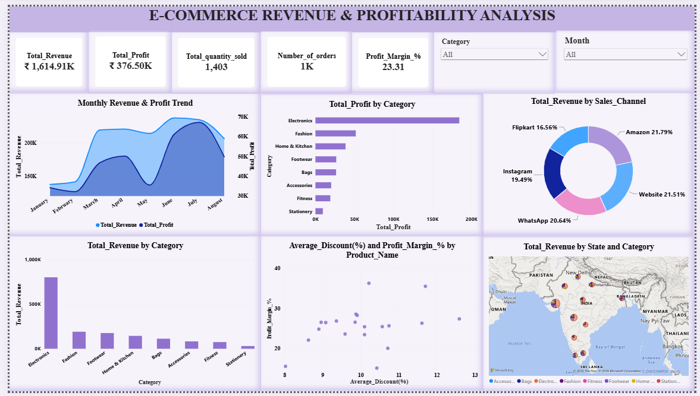
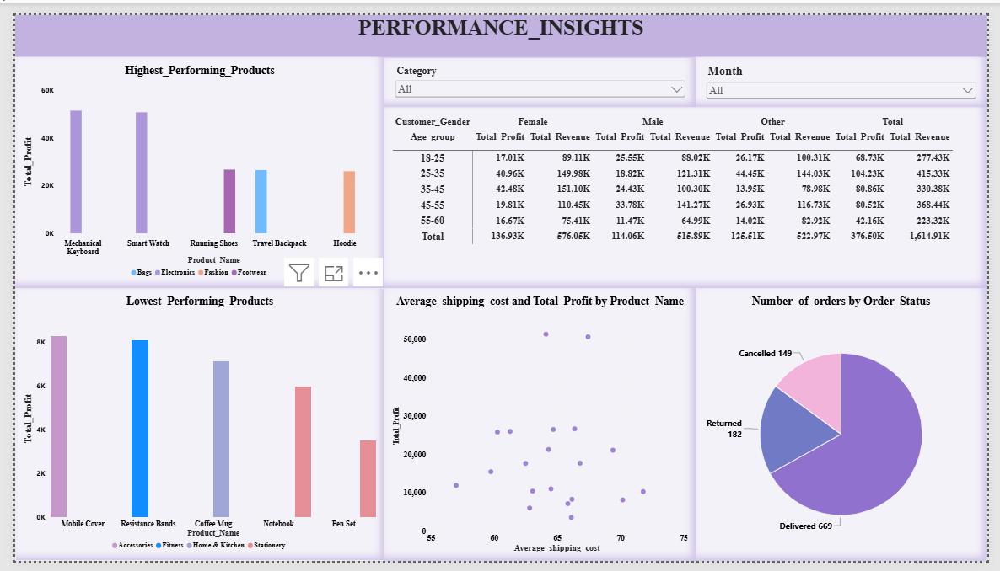

# E-commerce Revenue & Profitability Analysis
> **Tools:** Power BI | Excel | DAX | Power Query | Data Modeling  
> **Domain:** E-commerce

## 📌 Project Overview

The **E-commerce Revenue & Profitability Analysis** project focuses on analyzing e-commerce transaction data to understand revenue generation, profitability, product performance, customer segments, discount impact, and order trends.

The project uses **Power BI** to transform raw data into an interactive dashboard that provides meaningful business insights and supports data-driven decision-making.

## 🎯 Project Objectives

- Analyze revenue and profit performance across products and categories.
- Evaluate profitability using **Profit** and **Profit Margin**.
- Understand the impact of **discounts** on revenue and profitability.
- Analyze customer behavior based on **age and gender**.
- Compare performance across different **order channels and order statuses**.
- Identify important trends and patterns to support business decision-making.

## 📊 Dataset

The dataset contains e-commerce order, product, customer, pricing, and profitability information.

| Column | Description |
|---|---|
| Order_ID | Unique identifier for each order |
| Order_Date | Date on which the order was placed |
| Product_ID | Unique identifier for each product |
| Product_Name | Name of the product |
| Category | Product category |
| Unit_Cost | Cost of one unit of the product |
| Unit_Price | Selling price of one unit |
| Quantity | Number of units ordered |
| Gross_sale | Total sales value before discounts |
| Discount_Percent | Discount percentage applied to the order |
| Revenue | Revenue generated from the order |
| Commission_Percent | Commission percentage associated with the order |
| Shipping_Cost | Cost incurred for shipping |
| Total_expense | Total expenses associated with the order |
| Profit | Profit generated from the order |
| Profit_margin(%) | Profit margin percentage |
| City | Customer/order city |
| State | Customer/order state |
| Payment_Method | Payment method used for the order |
| Sales_Channel | Channel through which the order was placed |
| Order_Status | Status of the order |
| Customer_Age | Age of the customer |
| Customer_Gender | Gender of the customer |
| Product_Rating | Customer rating given to the product |

## 🔍 Problem Statement

1. Analyze overall revenue and profit performance across products and categories.
2. Evaluate profit margins to identify high- and low-performing products.
3. Assess the impact of discounts on revenue and profitability.
4. Analyze customer demographics based on age and gender.
5. Compare performance across different order channels and order statuses.
6. Identify revenue and profitability trends over time.
7. Identify the best- and worst-performing products based on revenue, profit, and profit margin.
8. Evaluate customer segments and sales channels to identify opportunities for improving overall profitability.

## 📈 Dashboard Features

- **KPI Cards** to display key metrics such as Revenue, Profit, Profit Margin, and Quantity.
- **Product and Category Analysis** to identify high- and low-performing products and categories.
- **Discount Analysis** to understand the impact of discounts on revenue and profitability.
- **Customer Analysis** based on Customer Age and Customer Gender.
- **Sales Channel Analysis** to compare performance across different sales channels.
- **Order Status Analysis** to evaluate order performance.
- **Time-Based Analysis** to identify revenue and profitability trends over time.
- **Interactive Category and Month Slicers** that allow users to quickly filter the dashboard and view specific revenue and profitability insights based on their selected category and month.

## 📈 Dashboard Preview

## 🛠️ Tools & Technologies

- **Power BI** – Data visualization and dashboard development
- **Power Query** – Data cleaning and transformation
- **DAX** – Calculated columns and measures
- **Microsoft Excel** – Data preparation and source data management

## 📌 Key Analysis Areas

### Revenue Analysis

Analyzed revenue across different products, categories, customer segments, and order channels to identify major revenue contributors.

### Profitability Analysis

Evaluated profit and profit margin to determine which products and categories contribute most effectively to overall profitability.

### Discount Analysis

Examined the relationship between discounts, revenue, profit, and profit margin to understand the impact of discount strategies.

### Customer Analysis

Analyzed customer age and gender to identify customer segments with stronger revenue and profitability contributions.

### Order Analysis

Compared order channels and order statuses to understand order performance and identify potential business opportunities.

## 💡 Business Insights

The dashboard helps users:

- Identify high-performing products and categories.
- Understand which customer segments contribute more to revenue and profit.
- Monitor profitability and profit margin.
- Evaluate the effect of discounts on business performance.
- Compare different order channels.
- Analyze monthly performance and identify trends.
- Make informed decisions regarding pricing, discounts, products, and customer targeting.

## 🚀 Project Outcome

This project demonstrates how **Power BI, Power Query, and DAX** can be used to transform raw e-commerce data into an interactive business intelligence solution.

The dashboard provides a consolidated view of **revenue, profitability, products, customers, discounts, order channels, and order performance**, helping identify important trends and support data-driven business decisions.

## 📌 Conclusion

The **E-commerce Revenue & Profitability Analysis** provides valuable insights into revenue generation, profitability, product performance, customer segments, discount impact, and order trends.

The analysis helps identify **high-performing products and categories, profitable customer segments, effective order channels, and the impact of discounts on profitability**. These insights can support better decision-making related to **pricing, discount strategies, product planning, and customer targeting**.

## 👤 Author

**Shinolin Jeba**

- Power BI Developer
- Data Analytics Enthusiast

## 🏷️ Tags

`Power BI` `E-commerce` `Revenue Analysis` `Profitability Analysis` `Data Analytics` `Business Intelligence` `Power Query` `DAX` `Data Visualization` `Dashboard` `Excel` `Customer Analysis` `Sales Analysis`

---

⭐ If you find this project useful, feel free to explore the dashboard and analysis.
